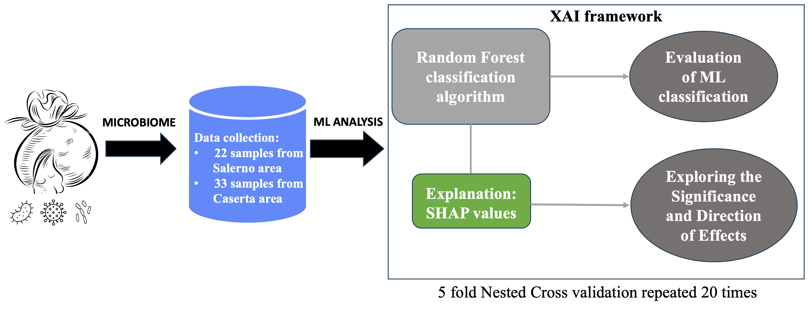

# Mozzarella di Bufala Campana PDO Microbiome

## 📄 Paper Information

**Title:** Explainable artificial intelligence and microbiome data for food geographical origin: the Mozzarella di Bufala Campana PDO Case of Study 
**Authors:** Michele Magarelli, Pierfrancesco Novielli, Francesca De Filippis, Raffaele Magliulo, Pierpaolo Di Bitonto, Domenico Diacono, Roberto Bellotti and Sabina Tangaro 
**Journal:** *Frontiers in Microbiology*, Volume 15 - 2024
**DOI:** [https://doi.org/10.1016/j.foodchem.2025.147013](https://doi.org/10.3389/fmicb.2024.1393243)
**Published:** 03 June 2024

The work was published in Consortium magazine, issue no. 2024/04, pp. 25–27, a publication dedicated to the analysis, promotion, and enhancement of the Geographical Indications (GI) system and quality agri-food products. Consortium is a quarterly magazine designed to provide an in-depth view of the diverse experiences within the agri-food and wine sectors related to Geographical Indications (GIs). It is published by the Italian Istituto Poligrafico e Zecca dello Stato and curated by Fondazione Qualivita. The magazine aims to analyze and showcase the activities of Italian PDO and PGI consortia and the companies associated with them.

---

## 🧠 Project Overview

This study presents a Machine Learning (ML) and Explainable AI (XAI) framework to identify the geographical origin of food products using microbiome data. Specifically, the case study focuses on Mozzarella di Bufala Campana PDO, leveraging microbial composition as a fingerprint of origin.

The approach exploits the fact that microbiota reflects environmental and production conditions, enabling the detection of region-specific patterns. XAI techniques are used to interpret model decisions, identifying key bacterial species driving classification and enhancing model transparency.

Key Features:
-	Microbiome-Based Analysis: Use of metagenomic sequencing data to characterize bacterial communities in cheese samples.
-	Classification Task: Prediction of geographical origin (Salerno vs Caserta).
-	Model Comparison: Evaluation of multiple supervised ML classifiers (Random Forest, XGBoost, MLP).
-	Explainability: SHAP analysis to identify the most influential microbial features for origin discrimination.

---

## ⚙️ Environment Setup

The analysis was conducted using Python-based ML frameworks, applying standard libraries for classification (e.g., scikit-learn) and microbiome data processing pipelines.

--- 

### Methodology Summary

The workflow implemented in the study follows these stages:
-	Microbiome Data Acquisition: DNA sequencing (Illumina NovaSeq) is used to obtain microbial profiles from 65 mozzarella samples, with taxonomic profiling via MetaPhlAn  
- Preprocessing: Features (bacterial species abundances) with >70% zero values are removed, reducing dimensionality and improving model robustness 
- Dataset Splitting: Validation set (cross-validation) and Independent test set (unseen samples) ensuring reliable performance assessment 
- Model Training & Selection:
- Three classifiers are compared: Random Forest (RF), XGBoost (XGB) and Multi-Layer Perceptron (MLP) using repeated 5-fold cross-validation  
- Model Evaluation: Accuracy, AUC (ROC curve), Precision, Sensitivity, Specificity
- Best Model: Random Forest demonstrating strong classification capability 
- Interpretation (XAI): SHAP analysis identifies key microbial species
